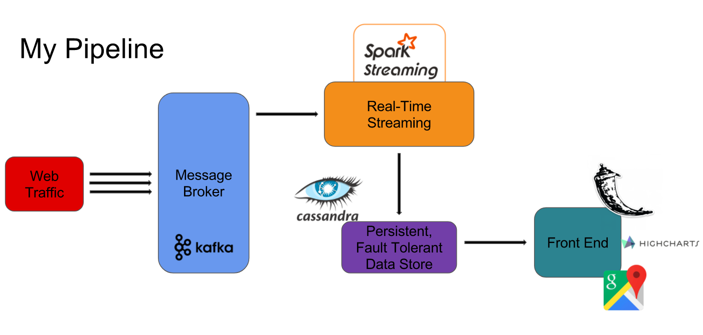

# Holler
_A real-time web traffic analytics dashboard_

## Motivation

In the age of **BIG** data, the scale of industry applications has outpaced the scope of analytical tooling. This presents a real challenge for engineers who are tasked with developing these tools. This project is meant to serve as an exercise in building a real-time distributed pipeline. 

## The Deliverable -- Anomaly Detection 

The contrived scenario is that Yelp has hired me to produce the first iteration of a dashboard product using their traffic accross all platforms. The key feature of focus is to provide 

## The Data

- Traffic 
	- artificially generated GET requests
	- produced ~4000 messages/second
- Yelp Businesses 
	- acquired through Yelp Fusion API 
	- ~200,000 businesses

## Pipeline

 

## Setup

This project was developed on AWS using 3 EC2 clusters, with 9 instances in total of type m4 large.

The following scripts initialize the Kafka Producers and Spark process, respectively:
`Kafka_Cluster/spawn_kafka_streams.sh` 1 

`Spark_Cluster/cassandra_consumer.sh` 2 

The Flask app can be initialized with the following command:

`flask/webapp/run.py` 3 

## Demo

[video](https://www.youtube.com/watch?v=44R1t5_Lu0o&feature=youtu.be)

### For other coding samples

Click [here](https://github.com/hugoz1234/170FullStack)

1 Dependencies: Zookeeper, Kafka, python2

2 Dependencies: Hadoop, Spark, Spark Streaming, python2

3 Dependencies: Flask, python2
